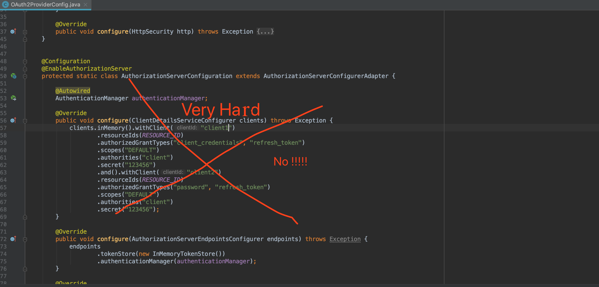
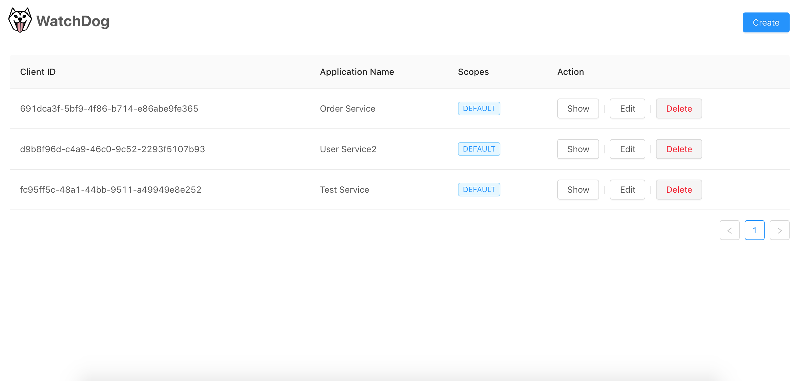
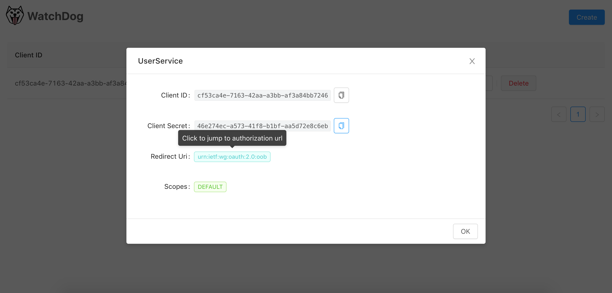
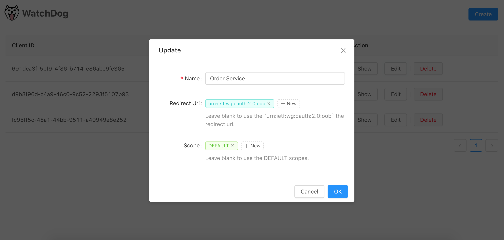
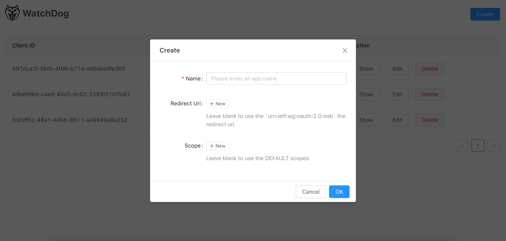
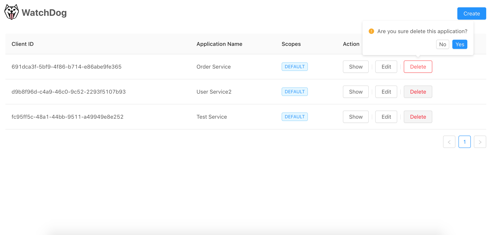

# watchdog-spring-boot-starter
Watchdog is an OAuth 2 provider for SpringBoot

该`starter`基于`spring-boot-starter-security`和`spring-security-oauth2`上做的改进封装，能够快速的搭建出一个可管理的`OAuth 2 provider`



在没有它之前你可能需要这样的硬编码或者使用`Redis`或`JDBC`等之类的来做这件事情难以管理，扩展也不便太麻烦使用起来不优雅。

## 如何使用

> 工程下也有示例项目在`smaple`文件夹中

执行项目根路径下面的`schema.sql`文件，创建所需的表，同时也欢迎大家来补充和扩展其它类型的数据库

在`pom.xml`文件中引入依赖（由于刚推送到Maven Central有的仓库还没有同步可能还需要几个小时）

```
<dependency>
    <groupId>org.yuequan</groupId>
    <artifactId>watchdog-spring-boot-starter</artifactId>
    <version>0.8.1.BETA</version>
</dependency>
```
然后再启动类上配置`@EnableWatchdog`注解
```
@SpringBootApplication
@EnableWatchDog
public class WatchdogSampleApplication {
    public static void main(String[] args) {
        SpringApplication.run(WatchdogSampleApplication.class, args);
    }
}

```
配置好的你的`PasswordEncoder`和`authenticationManager`，类似于以下：
```
@Configuration
public class WebSecurityConfig extends WebSecurityConfigurerAdapter {

    @Autowired
    private PasswordEncoder passwordEncoder;

    @Override
    protected void configure(AuthenticationManagerBuilder auth) throws Exception {
        auth.inMemoryAuthentication().withUser(User.withUsername("user_1").password(passwordEncoder.encode("123456")).authorities("USER"));
    }

    @Bean
    @Override
    protected AuthenticationManager authenticationManager() throws Exception {
        return super.authenticationManager();
    }

    @Bean
    public PasswordEncoder passwordEncoder(){
        return new BCryptPasswordEncoder();
    }
}
```
启动你的项目，输入网址`http://localhost:8080/watchdog.html`





可以点击授权重定向地址跳转到客户端认证授权，也可以复制`client_id`和`client_secret`进行`token`认证，例如http://localhost:8080/oauth/token?username=yourUser&password=yourPassword&grant_type=password&scope=DEFAULT&client_id=CLIENT_ID&client_secret=CLIENT_PASSWORD








## WatchdogUrlRegistryProvider

对`HttpSecurity`进行扩展是最常见不过的事情了，所以`Watchdog`提供了一种很优雅的方式去扩展，如下：

```java
@Component
public class AuthorizationProvider implements WatchdogUrlRegistryProvider {

    @Override
    public boolean configure(ExpressionUrlAuthorizationConfigurer<HttpSecurity>.ExpressionInterceptUrlRegistry config) {
        config.............
        return true;
    }
}
```

